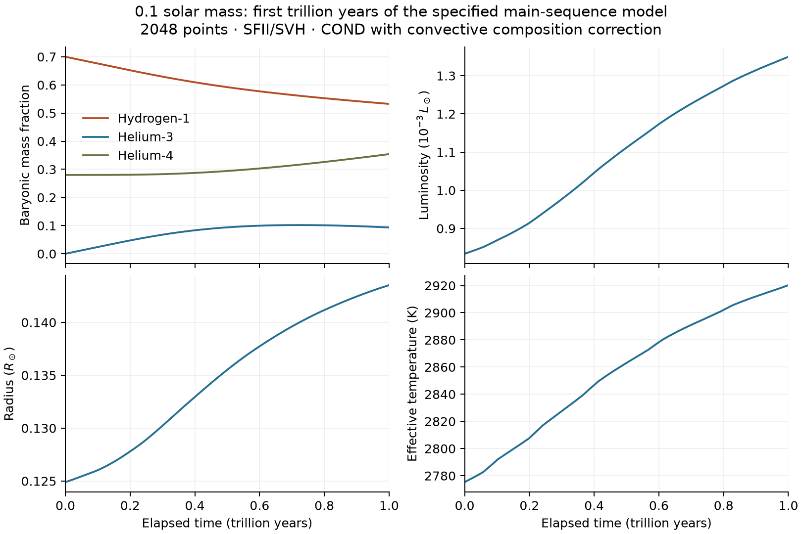

# Extending the 0.1 Msun experiment toward hydrogen depletion

The composition-dependent calculation reaches **one trillion years** from
its specified X=.7, He3=0 static initial model. This clock excludes formation
and pre-main-sequence evolution. The star remains fully convective, with
about .533 hydrogen and .093 helium-3 by baryonic mass at the end. This is
still an intermediate main-sequence calculation; it does not reach fuel
exhaustion, the blueward turn or helium-white-dwarf cooling.

The change supplies wider source composition grids, an atmosphere that
responds to the evolving mixture, and electron conduction. The atmosphere
used for the reference below is a differential approximation anchored to
solar COND data. A separate 48-cell helium-rich non-grey atmosphere grid is
now installed and documented in [NONGREY.md](NONGREY.md). The underlying equations,
conserved baryonic mass convention and implicit burn/mix/thermal solve are
described in [EVOLUTION.md](EVOLUTION.md).

## Reproduce

```sh
cmake --build build
ctest --test-dir build --output-on-failure
mkdir -p out
build/apps/ember-evolve 512 1e12 1e8 10 sfii-svh wd > out/evolution-extended-512-1tyr.json
build/apps/ember-evolve 1024 1e12 1e8 10 sfii-svh wd > out/evolution-extended-1024-1tyr.json
build/apps/ember-evolve 2048 1e12 1e8 10 sfii-svh wd > out/evolution-extended-2048-1tyr.json
build/apps/ember-evolve 512 1e12 1e8 2.5 sfii-svh wd > out/evolution-extended-512-1tyr-tight.json
python3 scripts/verify_composition_data.py --extended
```

Arguments are points, duration years, initial step years, timestep tolerance
multiplier, nuclear model, transport and atmosphere. Defaults are
`512 1e8 1e7 1 sfii-svh wd cond-corrected`; `--help` lists all choices.
Transport options are `wd`, `classic`, `undamped`, `none`, and `early`.
The last selects the historical four-plane EOS, nominal opacity and capped
frozen atmosphere, without conduction. Old 10/20-Gyr reproduction commands
now need that explicit option. Source bounds still throw on unsupported
states; none are replaced by clamping or arbitrary abundance extensions.

The trillion-year comparisons use tolerance multiplier 10: local scales
are 1e-4 in log structure, 1e-7 in active-species abundance and 1e-3 in
surface luminosity. The tighter run reduces all three scales fourfold.
Each accepted macrostep retains two implicit half steps. A small local
energy residual measures the discrete solve, not accumulated time error.
The full history and final profile are written as JSON when the run ends;
progress and retry diagnostics go to stderr.

The long reference runs began with the Z=.01/.02 TOPS opacity pair. Their mapped
metallicities stay between those planes, so the subsequently imported Z=.03
plane does not change their interpolation. Later driver reporting adds the
atmosphere integration settings and computes the initial convective fraction;
the compact histories omit the earlier initial-fraction placeholder. All
accepted convective fractions and the evolved physical states were recorded.

## One-trillion-year results and numerical comparisons

| Points | R/Rsun | L/Lsun | Teff (K) | H1 | He3 |
|---:|---:|---:|---:|---:|---:|
| 512 | .1435 | .001346 | 2918 | .5326 | .09350 |
| 1024 | .1435 | .001349 | 2920 | .5326 | .09344 |
| 2048 | .1435 | .001350 | 2920 | .5325 | .09344 |

The 2048-point reference has Tc=5.134e+6 K and rhoc=261.9 g/cm³. It
uses 926 accepted macrosteps and three rejected attempts. The largest
recorded last-half-step luminosity and nuclear mass-defect imbalances are
1.14e-8 and 1.53e-8 relative. Every accepted model is fully mixed; final
species spread is zero. He3 peaks at .1019 near 720.3 billion years,
then declines as its destruction overtakes production in the mixed star.

The 1024-to-2048 differences are .00683% in radius, .0731% in luminosity
and 8.45e-6 in absolute He3. The 512-to-1024 luminosity difference is .186%.
Fourfold tighter time tolerances at 512 points change final radius by
.000917%, luminosity by .00190%, and He3 by 1.21e-5 absolute. These are
useful numerical comparisons, not an established asymptotic convergence
order or physical uncertainty bounds. All four final states and diagnostics
are in [the convergence record](results/evolution_1tyr_convergence.json).
The [compact reference](results/evolution_m010_1tyr.json) retains the
accepted physical history; full profiles remain in the ignored `out/` files.



[Standalone PDF](results/evolution_m010_1tyr.pdf).

The [transport audit](results/transport_m010_1tyr.json) finds a maximum
local conductive flux fraction of about 3.04%, with .674% in the core.
Even with conduction included, the minimum midpoint ratio of diffusive to
adiabatic gradient is 14.76. The final mapped source H is .5183, opacity
source Z=.01931, and log g=5.124. No opacity point is closer than a
factor 30 to the high-density ceiling. The estimated plasmon luminosity is
1.48e-8 of surface luminosity; nuclear neutrinos are accounted separately
in the burning network. Accumulated nuclear rest-mass release corresponds
to .0763% of conserved baryonic mass, without feedback into gravitational mass.

The [nuclear audit](results/nuclear_m010_1tyr.json) gives central electron
susceptibility .5780 of its classical value and pp SVH exponent .2104.
Maximum active-layer pp zeta=.0771 stays below the .2 operational limit.
The reduced ppII/pp rate ratio reaches 7.53e-5; this does not constrain the
missing pep or other channels.

## Source composition coverage

| Input | Extended source family | Remaining approximation |
|---|---|---|
| FreeEOS EOS1 | X=.30,.40,.50,.55,.60,.65,.70,.75; original .0125-dex grid | Metals represented as He4; electronic He-isotope shifts omitted |
| AESOPUS 2.1 gas | Z=.01,.02,.03; X=0,.1,.2,.35,.5,.7,.8,.9,.95 | GS98 metal pattern; no grain opacity |
| TOPS ATOMIC | Z=.01,.02,.03; X=.3,.4,.5,.6,.65,.7,.75 | GS98 metal pattern; only original, unsubstituted source cells |
| Atmosphere anchor | Original COND tau=100 solar states, Teff=1800..3300 K, log g=3.5..6 | Non-grey correction transferred between compositions using a grey convective column |
| Electron conduction | Seven pure-ion charge planes, three published prescriptions | Approximate mixture collision sum and partial-degeneracy continuation |

These are **source** X/Z coordinates, not a rectangular domain in the
star's baryonic H1/He3 coordinates. The EOS and opacity map the actual
particle inventory before checking source support. A large He3 fraction
can therefore reach a source boundary earlier than nominal H1 suggests.
All eight FreeEOS raw grids, 21 TOPS mixtures, the selected AESOPUS archive
members and three original conductivity tables are archived with checksums.
Offline imports reproduce the selected files byte for byte. Normal builds
and tests require neither Fortran nor network access. See the
[EOS](../data/eos/README.md), [opacity](../data/opacity/README.md) and
[conduction](../data/conduction/README.md) data documentation.

`ElementalOpacity` replaces the old nominal-He3 wrapper. Let w_i be the
chosen abundance mass weight and a_i the physical atomic mass. Form

```
W_H = a_H X_H/w_H
W_He4 = a_He4 (X_He3/w_He3 + X_He4/w_He4),  W_He3 = 0
W_metals,i = a_i X_i/w_i
s = sum W_i,  X_source,i = W_i/s
rho_source = s rho,  kappa_actual = s kappa_source.
```

This preserves elemental number densities and extinction per unit length.
The shifted source Z is why metallicity planes are necessary even though
the evolved metal abundances stay fixed. ln opacity is interpolated linearly
in Z and X, with monotone interpolation in native thermal/density axes.
The existing temperature blends are retained. Analytic H1/He3 derivatives
include all source X, Z and density changes. He3 and He4 share electronic
cross sections: collision-induced absorption reduced masses, isotope shifts
and broadening are not independently recalculated. GS98 opacity metals
remain a proxy for the carried AAG21 mixture.

## Atmosphere and transport

`ConvectiveAtmosphere` integrates hydrostatic pressure and temperature from
a thin Eddington top to tau=100. It includes Henyey finite-optical-thickness
element cooling and uses the actual composition-dependent EOS and opacity.
The default alpha=1.9 and y=1/3 recover the interior MLT thick-element limit.
Analytic Teff and gravity sensitivities travel through the adaptive column
integration and into the stellar boundary Jacobian. Both state and
sensitivity integration tolerances are 2e-8; loosening the sensitivity
tolerance introduced enough integration noise to impede stellar relaxation.

`CompositionCorrectedAtmosphere` multiplies the original solar COND T and
gas pressure by `column(actual)/column(reference)` at the same Teff and g.
It then computes radiation pressure and inverts the actual EOS for density.
The reference composition recovers the original boundary exactly. This
assumes that a non-grey correction calibrated at the reference mixture
transfers as composition changes. See [ATMOSPHERE.md](ATMOSPHERE.md) for
equations and tests.

The [static sensitivity study](results/extended_boundary_sensitivity.json)
solves 512-point equilibria at four homogeneous compositions and nine
transport/boundary choices. The unanchored grey convective boundary changes
luminosity by +7% at the initial mixture and up to +14% at X=.45, He3=.08.
Changing y to .076 or column alpha to 1.5 has much smaller effects in the
*differentially corrected* models; doubling tau_top changes L by less than
8e-6 relative in the sampled cases. These comparisons are fixed-composition
equilibria, not age-matched tracks or calibrated physical error bars. They
identify non-grey atmosphere composition coverage as a leading uncertainty.

Electron conduction enters the interior through reciprocal addition of
radiative and conductive opacities. It also enters the diffusion criterion
used for convective mixing. Atmospheric optical depth uses radiative opacity.
The mixture uses electron-fraction-weighted resistivities at common electron
density. Conductance turns on smoothly between 3e5 and 1e6 K because the
source assumes full ionization; moving this explicit join is a control.
Weakly damped, undamped and uncorrected source prescriptions, removing
conduction, and changing the join leave the sampled fully convective static
structures unchanged within relaxation accuracy. Convection adjusts its
flux at almost the same adiabatic gradient. This does not justify omitting
conduction after a radiative core forms. See [CONDUCTION.md](CONDUCTION.md).

## Checks against independent data and physical limits

The extended-physics checks include 63 direct FreeEOS queries
between composition and thermal knots, 30 independent conductivity-code
queries, elemental number-density invariance, derivatives through opacity
blends, exact constant-opacity Eddington limits, atmosphere sensitivities,
and a helium-rich coupled evolution step with timestep refinement. Maximum
sampled EOS P/E and response differences are .083% and .421%; conductivity
interpolation differs from the source routine by at most .895% in the
sample. These validate the adopted formulas and interpolation, not their
physical approximations. The older FreeEOS molecular-join audit remains
relevant. Immutable EOS mask caching and precomputed polynomial powers
reduce runtime without changing source support or interpolation order.

Other physical inputs were considered explicitly:

- **Metals in the EOS:** fifteen direct FreeEOS comparisons replace the
  He4 proxy with a scaled GS98 mixture at three H/He compositions and five
  thermal states. Sampled differences stay below .91% in pressure, .88% in
  energy and .37% in cp/adiabat. The proxy remains declared; a matched
  metal-bearing potential family is still needed for precision work. See
  [the source comparison](results/extended_eos_metal_sensitivity.json).
- **Thermal neutrinos:** a final-profile audit evaluates the plasmon fit of
  [Haft, Raffelt & Weiss (1994)](https://arxiv.org/abs/astro-ph/9309014),
  equations 23–27. It is negligible on the tested branch. This is only the
  plasma process, not a bound on all photo/pair/bremsstrahlung/recombination
  losses. A complete loss module remains necessary before remnant cooling.
- **Nuclear channels:** the existing SFII/SVH prescription is retained and
  re-audited. The commonly quoted pep/pp fit in equation 46 of
  [Solar Fusion II](https://arxiv.org/abs/1004.2318) explicitly applies at
  10–16 MK; this star's core is only about 5 MK and partly degenerate.
  Extrapolating it would not supply a validated pep rate. A cold,
  degeneracy-aware capture calculation, fuller screening consistency,
  pp curvature and the missing channels remain nuclear work. A tiny ppII
  fraction does not establish that all omitted channels are negligible.
- **Composition-gradient transport:** every accepted model on the tested
  branch is fully mixed. This branch does not yet require transporting
  material across a moving radiative-core boundary. Ledoux stability,
  diffusion, semiconvection and adaptive meshing remain necessary before
  trusting that later regime; Schwarzschild mixing is still the implemented
  criterion.
- **Mass and later phases:** gravity continues to use conserved baryonic
  mass while nuclear mass defects supply energy. The accumulated rest-mass
  change is audited separately. Blueward evolution will encounter the
  COND Teff bound and eventually the source composition bounds. Cold dense
  burning, diffusion, crystallization and other remnant inputs are not
  supplied by extending these tables.

The first non-grey H/He family is now available in [NONGREY.md](NONGREY.md).
Further work includes extending its composition coverage toward depletion,
matching the atmosphere and interior metal mixtures, and validating transport
as the star develops composition gradients. The one-trillion-year calculation
is a reproducible intermediate checkpoint for that work.

## Reproduce the separate physical audits

Run from the repository root after building the library:

```sh
c++ -std=c++23 -O2 -Iinclude scripts/evolution_physics_probe.cpp build/src/libember.a -o /tmp/ember-evolution-physics-probe
python3 scripts/audit_extended_track.py /tmp/ember-evolution-physics-probe out/evolution-extended-2048-1tyr.json docs/results/transport_m010_1tyr.json
c++ -std=c++23 -O2 -Iinclude scripts/nuclear_probe.cpp build/src/libember.a -o /tmp/ember-nuclear-probe
python3 scripts/audit_nuclear.py /tmp/ember-nuclear-probe out/evolution-extended-2048-1tyr.json docs/results/nuclear_m010_1tyr.json
c++ -std=c++23 -O2 -Iinclude scripts/compare_extended_boundaries.cpp build/src/libember.a -o /tmp/ember-compare-boundaries
/tmp/ember-compare-boundaries > out/extended-boundary-comparison.json
python3 scripts/audit_freeeos_metals.py /path/to/freeeos-probe docs/results/extended_eos_metal_sensitivity.json
python3 scripts/summarize_extended_evolution.py out/evolution-extended-512-1tyr.json out/evolution-extended-1024-1tyr.json out/evolution-extended-2048-1tyr.json out/evolution-extended-512-1tyr-tight.json --plot
```

Only the optional `--plot` requires matplotlib. It writes a standalone PNG
and PDF alongside the compact numerical records. The boundary comparison
prints JSON rows; its versioned result adds mesh and interpretation metadata.
The source metal audit needs the external FreeEOS
probe, while the final-profile audits use the ordinary C++ library.
