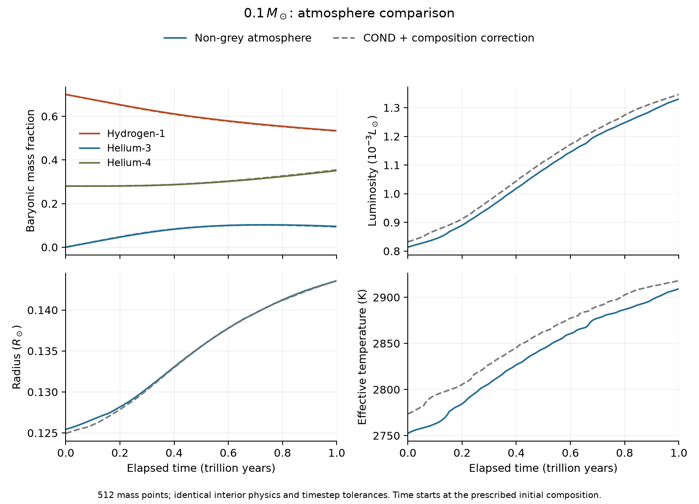

# Helium-rich non-grey atmospheres

The source specification below records the original gas family. The current
72-cell extension, metal-bearing interior EOS, mixture comparisons and
condensate experiments are described in [FORWARD_EVOLUTION.md](FORWARD_EVOLUTION.md).

`CompositionAtmosphereGrid` supplies an atmosphere boundary from independent
LTE radiative-transfer calculations on a rectangular grid in baryonic H1,
He3, effective temperature and surface gravity. The five Ember metal
abundances and Rosseland matching depth are fixed for a family. This backend
is distinct from the differential grey correction described in
[ATMOSPHERE.md](ATMOSPHERE.md).

The source pipeline uses [TLUSTY208/SYNSPEC54](https://arxiv.org/abs/2104.02829)
and the molecular data distributed with
[Synple](https://github.com/callendeprieto/synple/tree/703549b60031c5f6dd2446ad933b129c070a6560).
It solves hydrostatic balance, wavelength-dependent radiative transfer and
radiative/convective equilibrium. SYNSPEC supplies absorption per unit
baryonic mass. TLUSTY adds electron and Rayleigh scattering; they must not
also be included in the absorption table.

## Physical specification

The recipe includes atomic lines, the general solar molecular line list,
TiO and water, the H-, H2+, He-, CH, OH and H2- continua, and collision-induced
absorption from H2-H2, H2-He, H2-H and H-He. Molecular equilibrium is enabled
below 10,000 K. The source's partition functions restrict relevant molecular
temperatures to 1000–16,000 K; the material grid stays inside that
interval. Wavelengths are in vacuum, spanning 900 Å to 30 microns. The adopted
microturbulence is 1 km/s and mixing-length parameter is 1.9.

The distributed CIA tables have separate temperature limits: H2-H2 and
H2-He span 1000–7000 K, H2-H spans 1000–2500 K, and H-He spans
1000–10,000 K. The source holds coefficients constant above their upper
temperature endpoints and supplies negligible absorption outside their
wavenumber intervals. These retained source prescriptions are additional
approximations, particularly for H2-H in dissociation layers. The source
H2- continuum spans 3505–151883 Å; it contributes zero outside that range.

The atmosphere is a plane-parallel gas in LTE, with no irradiation,
condensates, rainout, magnetic support or spots. These choices are physical
approximations. In particular, cool upper layers can form condensates even
when Teff exceeds their condensation temperature. This gas calculation must
not be advertised as reproducing the dust chemistry of the COND anchor.
The MLT parameter is uncalibrated; equal alpha values in two different MLT
implementations do not establish identical convective efficiency.

Metal opacity uses the same declared GS98 proxy as the extended interior
opacity family. It does not resolve Ember's five-species metal inventory
element by element. The source atmosphere EOS includes molecular metal
chemistry; the interior FreeEOS wrapper represents metals as helium. Their
thermodynamic mismatch remains an uncertainty at the matching point.

Helium-3 is important in this star. A source calculation using He4 masses
throughout would give the wrong number of helium atoms per gram. Both source
programs therefore load an explicit element-mass file. With atomic mass unit
`mu`, H has mass `mu`, and the mean helium mass in units of `mu` is

```
AHe = (X3 + X4) / (X3/3 + X4/4).
NH/rho = XH/mu
NHe/rho = (X3/3 + X4/4)/mu.
```

Other elements use declared representative integer isotope masses. The
patched source weights multiply its native `HMASS`, so the density used for
opacity, the molecular EOS and hydrostatic balance is consistently baryonic.
There is no gravity rescaling. Electronic cross sections, isotope line
shifts and collision-induced absorption remain approximated by the source
helium data; an effective helium mass in Doppler widths is not an
isotope-resolved line profile. Source physical constants are retained for
reproducibility; their Stefan–Boltzmann constant differs from Ember's by
about 0.022%.

## Reproduction

Normal C++ builds require neither a Fortran compiler nor network access.
Generating a source family requires Python 3.11 or later, gfortran, several
GB of temporary storage, and a substantial calculation. The preparation
step retains and verifies pinned downloads and records compiler, executable,
data and patch hashes. The public FTP login in the script is the one
published by the source author for these line lists.

```
python3 scripts/prepare_nongrey_sources.py /tmp/ember-atmosphere-source
python3 scripts/generate_nongrey_grid.py \
  /tmp/ember-atmosphere-source/prepared.json \
  data/atmosphere/sources/nongrey_candidate_specification.json \
  /tmp/ember-atmosphere-family --jobs 3 \
  --initial-models data/atmosphere/sources/nongrey_gs98_z020
```

`--offline` on preparation uses the verified download cache. Generation
supports `--opacity-only` and `--plane N`. Source runs are reused only when
their input/executable fingerprints and output hashes match. Changed
specifications or provenance require a new work directory. A Fortran zero
exit code alone is insufficient: `STOP` can return zero after a failure.
Each material isotherm runs in a fresh source process and is checkpointed
independently. Assembly copies the original cells into the full source
table without interpolation. Completed isotherms survive a failed later
calculation; no incomplete atmosphere family is imported.
The 21-temperature material grid extends down to 1075.69 K. Its explicitly
stored temperature values preserve the earlier 19 isotherms exactly.
`--reuse-opacity WORK` finds matching isotherm inputs even when their indices
change after an extension, then verifies the complete run fingerprint.
`--initial-models WORK` can use completed structures from a matching family
as initial guesses; the final model is solved again with the selected source.
It also reads the compressed completed structures in the installed source
archive, verifying the original receipt against decompressed output bytes.
The command above uses those converged profiles to avoid repeating the
difficult initial convection search. Omitting this option generates coarse
starting models, which can need additional initialization work before every
cell converges.
It also accepts interrupted structures accompanied by `checkpoint.json`:
the reader checks their original input physics, executable/input fingerprint,
file hashes, grid labels and positive structure. Such a checkpoint makes no
final flux or convergence claim and cannot supply an imported grid cell.
The [archived checkpoint regression](results/nongrey_initial_checkpoint.json)
demonstrates this distinction and rejects altered or mislabeled inputs.
Opacity preparation uses at most four simultaneous source jobs; atmosphere
generation supports up to eight. Rejections are reported per model and never
filled into the grid.
`python3 scripts/nongrey_status.py WORK` reports saved isotherms, validated
atmospheres and the last-started source runs. A saved PID is diagnostic
information and is not treated as proof that a process is still running.

A complete accepted work directory can be archived without its large opacity
binaries and reimported offline:

```
python3 scripts/archive_nongrey_grid.py /tmp/ember-atmosphere-family \
  data/atmosphere/sources/nongrey_gs98_z020
python3 scripts/import_nongrey_grid.py \
  data/atmosphere/sources/nongrey_gs98_z020/manifest.json \
  data/atmosphere/nongrey_gs98_z020_tau100.dat
```

The archive checks source output receipts, each original opacity table's
composition and axes, and the table hash loaded by every atmosphere. It
retains the recipe, source provenance, isotherm inputs and diagnostics,
atmosphere inputs and outputs, and a hash inventory. Archiving cannot promote
an incomplete or rejected family.

The native dense synthesis executable is retained as `dense_synspec` in the
preparation receipt. The default sampling variant evaluates the original
line and continuum routines at the prescribed opacity wavelengths, using
at most 16 samples per continuum interpolation interval. It retains the
source line-selection threshold and broadening prescriptions. All selected
lines must fit in memory; it fails if the source starts chunking a list.
To fit the pinned inputs in the macOS executable address space, the extra
H2/He molecular broadening arrays are reserved for the third molecular list
(water); a nine-column list in another position is rejected.

The source patches also correct array bounds and output bookkeeping exposed
by the cool calculations: inconsistent abundance-array dimensions,
out-of-range helium-profile and CIA accesses, previous-line cache indices,
the H2- wavelength limit, and a final-row electron-density overwrite.
They preserve the dense algorithm for comparison. Bounds checking is enabled
in both builds. Source outputs retain full precision in the final depth
profile, so precision loss in printed temperatures cannot dominate the
boundary interpolation.
TLUSTY's atomic partition-function machinery supports elements through Zn.
All nonzero GS98 proxy elements lie in this range; heavier trace placeholders
remain in the chemistry bookkeeping without activating those atomic
queries. A source patch preserves their explicitly requested abundance
instead of substituting the default inactive-element abundance.
They also repair TLUSTY's He/H2 Rayleigh setup, which used an uninitialized
frequency, and bound both temperature indices after a Newton trial leaves
the opacity table. These changes are included in the pinned patch receipt.
In Rybicki mode the source disables the separate particle-conservation
unknown and updates density through `ELDENS`. The original molecular routine
then restored the old density and molecular weight whenever that unknown
was disabled. The patch retains the chemical density for Rybicki updates.
An independent final evaluation of density from chemical equilibrium at
each reported T/Pgas must agree with the structure to 0.2%. A pre-fix pilot
retained an atomic molecular weight and differed from FreeEOS by 54% at
the join; it is rejected and cannot supply physical grid cells.

The molecular-equilibrium stopping tolerance is tightened from `1e-3` to
`1e-8`. The original tolerance made entropy derivatives insufficiently
accurate for deep convection: a 300-depth model with tiny temperature
corrections still reported a 0.34% flux error. With tighter chemistry this
falls to 0.0012%. The importer verifies the loaded chemistry tolerance.
The final convection derivative uses `DERT=1e-5`; the thermodynamic entropy
differences retain the source's 1% temperature/pressure intervals. These are
separate numerical controls. SYNSPEC's opacity calculations retain their
native chemical stopping tolerance; they do not differentiate the entropy.

The earlier `DERT=.001` produces a repeating small correction cycle in a
3000 K/logg5.15 solar-composition model. Reducing the derivative interval
to `1e-5` converges the retained structure in three iterations: maximum
temperature correction 4.4e-7, maximum local flux error 8.3e-6. Neither
the correction criterion nor the independent flux limit is relaxed.

An independent [convection Jacobian check](results/nongrey_convection_jacobian.json)
exposed two errors in RYBENE's interior integral-flux stencil: the diagonal
used the wrong pair of face derivatives, and the upper-face gradient
derivative omitted the radiative-loss factor used by the lower face.
The patch assembles the derivative of the actual flux difference and applies
the same radiative-loss factor at both faces. Both face temperature
derivatives now use the declared `DERT`. The convection flux law and energy
residual are unchanged. With the native source routines and an analytic
ideal molecular EOS, all nine checked matrix entries agree with centered
finite differences to 1.3e-6 relative; the original diagonal has the wrong
sign in every fixture. Run `scripts/check_nongrey_convection.py SOURCE WORK`
to repeat this source-level check with gfortran. The historical source patch
is retained with the validation files. At 2800 K/logg4.9/XH=.7/X3=0, the prior source needs Ng acceleration
and 28 iterations; the corrected source converges without acceleration in
eight iterations. Both final profiles pass the flux and chemistry checks;
their matching T/Pgas differ by only +0.000165%/-0.000786%. The installed
family has been reconverged with the corrected source.

The [native opacity derivative check](results/nongrey_opacity_derivative.json)
finds two further OPACTR errors. The forward opacity differences were divided
by the temperature at the last depth, rather than at the depth being
differentiated. The perturbation also left molecular weight and gas pressure
changed. The repair uses the local temperature, restores the saved particle
density/gas pressure, recomputes the base chemical state and restores the
original structural density, electron density and mean weight. An analytic
temperature-dependent EOS/opacity fixture exposes 50% and 25% derivative
errors and a 0.2% pressure drift before repair; all six corrected queries
agree with their prescribed secants and restore the state to 1.5e-14.
`scripts/check_nongrey_opacity_derivative.py SOURCE WORK` repeats the check.
Full solar and helium-rich control atmospheres pass the independent physical
checks; their matching states differ from earlier converged results by less
than one part per million. Earlier source patches remain archived so the
preceding numerical studies retain their original provenance.

The cool solver limits each temperature update to a factor of 1.03 and uses
`ILGDER=1`, so the initial model and final convection diagnostic use the
same logarithmic gradients as the Rybicki equations. With the inconsistent
default diagnostic, a pre-chemical-fix 2800 K pilot reported a 42% flux error despite small
iteration corrections; the consistent 100-depth calculation reports 0.24%.
The 0.2% final acceptance limit is unchanged. Optional `initial_depths` and
`initial_frequencies` settings solve a coarse starting atmosphere, then
interpolate only that initial guess onto a finer column mesh. The fine
calculation must independently converge at its requested resolution, and
its exact initial structure is archived and included in the run fingerprint.
New source runs also save a structure checkpoint after each iteration;
these initial guesses cannot substitute for the required final diagnostics.

The hottest high-gravity XH=.7/X3=.12 cell needs a convective initial
profile. Copying the completed X3=0 model directly can leave deep layers
initially stable and produce large radiative temperature corrections.
The archived `solar-he3-hot-convective-initialization` control enables the
source's `ICONRE=3, ICONRS=1, IDEEPC=3, CRFLIM=-1` refinement for the first
three iterations; `IMUCON=200` disables its later experimental branch.
It then converges the unchanged equilibrium equations in eight further
iterations, with flux error 6.3e-6 and maximum correction 3.3e-7. Its completed
target-composition structure supplies the initial guess for a separate
final cell using the canonical family parameters. This refinement changes
initialization, not the accepted flux law or convergence limits.

The archived [reference depth study](results/nongrey_source_benchmark.json)
uses the author's 5500 K, log g=4.5 input and original opacity table. Small
iteration corrections at 70 and 100 depths coexist with flux errors of
1.73% and 0.754%; both are rejected. At 200 depths the maximum flux error is
0.196%. This historical study predates the He/H2 Rayleigh correction and
uses the original gradient diagnostic. The capacity-only change reproduced
its T/P state exactly; that statement does not describe the later physical
Rayleigh fix.
This is a source regression, not validation of a cool helium atmosphere.

The [dense/sampled opacity comparison](results/nongrey_opacity_sampling.json)
covers 2800/6000 K, densities `1e-8`/`1e-5` g/cm³, XH=.55 and X3=.1.
Across those four states, Rosseland absorption means differ by at most
0.74%, and Planck absorption means by at most 0.60%. Individual spectral
samples can differ much more, particularly near narrow lines and continuum
edges. These averages do not validate the emergent spectrum or establish an
atmospheric error bar. Original binary tables, source inputs, logs and hashes
are archived under `data/atmosphere/sources/nongrey_validation/`; use
`scripts/compare_nongrey_opacity.py` to repeat the comparison.

The [material interpolation audit](results/nongrey_material_interpolation.json)
compares direct source opacities at four independent T/rho states with
TLUSTY's bilinear interpolation in logarithmic opacity, temperature and
density. At 2889.6/4290.4 K and densities `1.14e-5`/`1.47e-4` g/cm³, the
interpolated Rosseland absorption means exceed the direct values by up to
4.52%; Planck absorption means are lower by up to 10.81%. This is a larger
numerical uncertainty than the wavelength and depth checks. Halving the temperature spacing and reducing the density log10 spacing
from 0.556 to 0.394 over the held-out atmosphere's actual support changes
its matching T/Pgas by -0.00067%/+0.332%. The finer model independently
passes the flux, chemical-density and full-profile support checks. This
local boundary comparison does not bound errors elsewhere in the family. Archived reference stencils copy original source cells
exactly; the comparison can be repeated with
`scripts/compare_nongrey_opacity.py --interpolate-reference`.

## Computational cost

Atmospheres are precomputed; stellar timesteps interpolate their matching
states. The first 512-point, 20-Gyr evolution trial takes approximately
14 seconds of wall time. Rebuilding the atmosphere family is a separate,
much larger calculation: each of 48 models uses 300 depths and 20,000
transfer frequencies, with composition-specific opacity tables sampling
atomic and molecular line lists containing about 26.5 million lines.

Both executables are native ARM64. Ember's C++ Release build explicitly
targets `apple-m4`, permits fused multiply-add contraction and links
Accelerate; its current small Henyey blocks use a portable pivoted kernel.
The Fortran source generators use `-O2` with bounds checks and generic ARM
targeting. Eight independent atmosphere processes run concurrently; opacity
generation is capped at four because of its line-list memory footprint.
These generators currently use neither a GPU nor internal parallel loops.

An [instrumented source replay](results/nongrey_cpu_profile.json), starting
from an accepted 2800 K/logg5.15 solar-composition atmosphere, measures:

| Phase | Process CPU seconds |
|---|---:|
| Initialization | 1.77 |
| Formal solution, including final diagnostics | 38.69 |
| Radiative-transfer matrix assembly/elimination | 16.86 |
| Energy equation and convection | 27.64 |
| Dense 300-by-300 solve | 0.0033 |
| Structure update | 1.60 |

Within those phases, molecular chemical equilibrium accounts for 46.79
seconds (54%) in 8,995 calls. It is included in the table, not an additional
cost. The replay takes 86.96 wall seconds while other grid jobs run. It
contains one Newton iteration plus initialization and final checks; these
fractions are not whole-grid averages. Matching T/Pgas changes by less
than 1e-9 relative, and all physical acceptance checks pass.
This timing uses the source preceding the opacity derivative repair; its
exact source and executable hashes are retained with the result.

The dominant targets are chemistry evaluations, radiative-transfer work
and convergence. In particular, the Rybicki radiative block repeats the
same tridiagonal factorization for each temperature-derivative column at
each frequency. Reusing that factorization is an optimization opportunity;
the current production source has not been changed for this purpose.
The three-millisecond dense solve cannot explain the large wall time.
`scripts/profile_nongrey_source.py` performs the timing in a separate source
copy; its driver and original diagnostic outputs are archived.

## Acceptance and interpolation

The installed `data/atmosphere/nongrey_gs98_z020_tau100.dat` contains all
48 cells: XH=.45/.7, X3=0/.12, Teff=2600/2800/3000/3200 K and
log g=4.9/5.15/5.4, at fixed Z=.02 and tau=100. Each uses 300 depths and
20,000 transfer frequencies. The largest final local flux error is .0391%,
the largest temperature correction is 9.45e-7, and independent chemical
density closure is better than 4e-13. Original inputs, outputs, initial
structures, source receipts and opacity hashes are retained in
`data/atmosphere/sources/nongrey_gs98_z020/`; offline reimport reproduces
the installed states. All 24 CTest suites pass; source acceptance now includes
22 Python cases, including archived starting-structure integrity
and the complete physical-family reimport.

The [complete-family audit](results/nongrey_family_audit.json) compares
Ember's EOS with source density at all 48 matching states. Relative density
differences span -.266% to +1.266%. This measures the atmosphere/interior
EOS mismatch; it is separate from the source's own chemical closure test.
The runtime consistently obtains density from Ember's EOS.

The archived [cool source checks](results/nongrey_atmosphere_validation.json)
include a successful 2800 K, log g=5.15 solar-composition atmosphere and an
independent XH=.55, X3=.1 calculation. At the solar matching point, increasing
depths from 300 to 400 changes T/Pgas by 0.00015%/0.00040%; increasing transfer
frequencies from 20,000 to 30,000 changes them by 0.0058%/0.0365%. These numbers
describe the matching state, not convergence of every upper layer or of an
emergent spectrum. At XH=.55, X3=.1, interpolation between the four composition corners
changes the matching temperature by +0.159% and gas pressure by +0.071%
relative to the independent source atmosphere. This tests one interior
composition at a Teff/gravity node; it does not establish an error bound
throughout the grid.

At XH=.55, X3=.1, Teff=2900 K and logg=5.1, the independent model lies
between nodes on all four axes. The matching temperature from the 16
surrounding accepted cells differs by +0.327%, and gas pressure by -0.255%.
The direct model and all surrounding nodes use the final source repairs
and DERT=1e-5. This is another local interpolation check; it does not bound
errors at unsampled compositions or atmospheric parameters.

The importer requires all composition/Teff/gravity cells, archived source
inputs and outputs, and matching checksums. It checks the requested mixture,
baryonic element masses, loaded-mass marker, transfer mode, convection
parameter and depth/frequency settings. Each accepted structure must have:

- a complete final profile and independent final correction vector;
- maximum relative correction at most `1e-5`;
- total local flux within 0.2% of the requested flux at every depth;
- emergent bolometric flux consistent with the requested Teff;
- gas pressure consistent with the specified gravity to 1%;
- density consistent with an independent chemical-equilibrium evaluation
  at the final temperature and gas pressure to 0.2%;
- its entire converged T/rho profile inside the original opacity rectangle;
- matching optical depth strictly bracketed by source depth points.

Intermediate source iterations can probe outside the opacity rectangle.
TLUSTY's internal clipping/extrapolation during those iterations is not a
proof of source coverage; the independent final-profile check is mandatory.
The acceptance tolerances measure solver consistency, not physical accuracy.
Opacity sampling, material-grid interpolation, depth resolution and
composition interpolation need separate convergence checks.

The imported state is log T and log gas pressure interpolated in log
Rosseland depth. Runtime interpolation uses convex multilinear weights in
`(XH, X3, log10 Teff, log10 g)`. Analytic Teff, gravity and composition
derivatives come from that same interpolant, including cross terms.
Radiation pressure `a T^4/3` is added once; density is obtained from the
caller's EOS at the actual composition. Derivatives are one-sided at grid
knots, as appropriate for a multilinear interpolant.

There is no composition clipping, extrapolation, missing-cell interpolation
or fallback atmosphere. A grid's documented mixture approximations require
explicit selection. The evolution application accepts:

```
build/apps/ember-evolve 512 1e8 1e7 1 sfii-svh wd \
  nongrey:/absolute/path/to/atmosphere.dat
```

The non-grey evolution mode chooses its trial radius and effective
temperature from the interior of the supplied Teff/gravity rectangle.
It scales only the starting luminosity guess; relaxation still solves the
original energy equations. The previous 0.15 Rsun polytropic guess has
Teff≈2564 K and can lie below a cool-dwarf grid starting at 2600 K.

The first [coupled non-grey trial](results/evolution_nongrey_m010_20gyr.json)
uses a complete 24-cell cool subset at 512 stellar mesh points. It reaches
20 billion years with 17 accepted macrosteps and no retries, remaining fully
convective. The final state is R=.125727 Rsun, L=.000815446 Lsun,
Teff=2750.81 K, XH=.695399 and X3=.00460057. The largest recorded luminosity
and nuclear mass-energy balance errors are 4.7e-9 and 1.5e-8. These are
conservation diagnostics, not physical error bars. This pilot predates the
final derivative repairs and remains a historical source control.

The default remains the existing COND-based convective composition
correction as an established comparison. The installed non-grey grid is
selected explicitly using the argument above. Synthetic C++ fixtures validate the reader
and derivatives; they are never installed as physical atmosphere data.

## One-trillion-year stellar comparison

The complete final-source family evolves the 0.1 Msun model to **1e12 yr**
at 512 mass points. It accepts 906 macrosteps, rejects one attempt and takes
612.3 wall seconds on the M4 Max. The star remains fully convective throughout.
Its final central temperature is 5.12268 million K and density is
261.626 g/cm³. Hydrogen reaches .53389752, He3 .09509109 and He4 .35101139
by baryonic mass. He3 peaks at .10256641 near 736.81 billion years.
Time starts from the specified static XH=.7/X3=0 composition, excluding
formation and pre-main-sequence evolution.

| Atmosphere, same 512-point interior and time tolerances | R/Rsun at 1e12 yr | L/Lsun | Teff (K) | H1 | He3 |
|---|---:|---:|---:|---:|---:|
| COND + convective composition correction | .14354956 | .0013460338 | 2918.03 | .53259477 | .09349773 |
| Composition-dependent non-grey gas grid | .14357836 | .0013302286 | 2909.13 | .53389752 | .09509109 |

The new atmosphere changes final radius by +.0201%, luminosity by -1.174%
and effective temperature by -8.90 K. The largest recorded last-half-step
luminosity and nuclear mass-energy imbalances are 1.12e-8 and 1.51e-8.
These check the discrete equations, not accumulated time error. The older
COND mesh/timestep comparisons do not establish convergence of this new
512-point track; the atmosphere numerical checks above also remain local.

The [compact reference](results/evolution_nongrey_m010_1tyr.json) retains the
accepted history, grid/source hashes, timing and direct comparison. The
[static comparison](results/nongrey_boundary_sensitivity.json) and three
helium-rich coupled-step checks also pass, including XH=.46/X3=.08 near
the grid's hydrogen floor. Full stellar profiles and progress logs are in
the ignored `out/evolution-nongrey-512-1tyr.*` files.

The [final transport audit](results/transport_nongrey_m010_1tyr.json) finds
zero species spread, a minimum diffusive-to-adiabatic gradient ratio of
14.70 and maximum estimated local conductive flux fraction of 3.07%.
Opacity densities remain at least a factor 30 below the source ceiling.
The plasmon-only loss estimate is 1.49e-8 of surface luminosity; this is
not a total thermal-neutrino calculation. The [nuclear audit](results/nuclear_nongrey_m010_1tyr.json)
finds maximum active-layer pp zeta=.0771, within the .2 screening limit,
and a reduced ppII/pp ratio of 7.26e-5. The previously documented missing
nuclear channels and screening approximations remain.

```sh
build/apps/ember-evolve 512 1e12 1e8 10 sfii-svh wd \
  nongrey:data/atmosphere/nongrey_gs98_z020_tau100.dat \
  > out/evolution-nongrey-512-1tyr.json
python3 scripts/plot_nongrey_evolution.py out/evolution-nongrey-512-1tyr.json \
  out/evolution-extended-512-1tyr.json
```

Plotting requires matplotlib. The opacity/EOS and atmosphere bounds remain
strict. XH=.45 is the atmosphere floor: this family is an intermediate
main-sequence input, not coverage through hydrogen exhaustion, the blueward
turn or white-dwarf cooling.



[Standalone PDF](results/evolution_nongrey_m010_1tyr.pdf).
